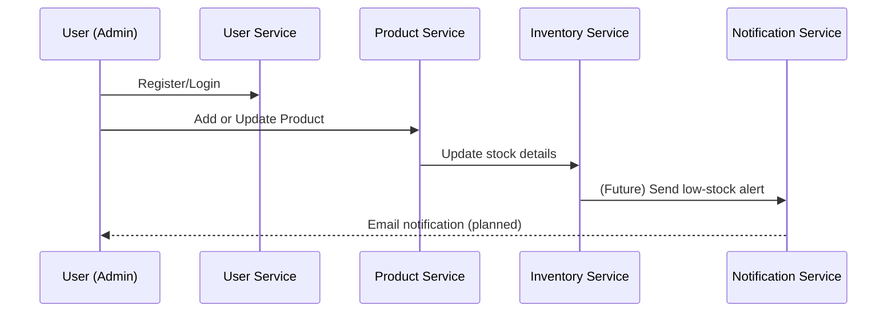

# 🏢 InvenTrack — DevOps-Integrated Inventory Management System

### 🚀 A full-fledged microservice-based system built using **Java Spring Boot**, **Docker**, and **MySQL** with centralized configuration and service discovery.

---

## 🧩 **Project Overview**

**InvenTrack** is a distributed **Inventory Management & Notification System** that automates stock tracking, purchase order generation, and alert notifications.
It follows a **microservices architecture** integrated with **DevOps practices**, ensuring scalability, maintainability, and deployment automation.

---

## ⚙️ **Tech Stack**

| Layer             | Technologies                                                               |
| ----------------- | -------------------------------------------------------------------------- |
| Backend           | Java 25, Spring Boot 3.5.7                                                 |
| Microservices     | Spring Cloud Config, Eureka Discovery                                      |
| Database          | MySQL (Dockerized), Adminer                                                |
| Configuration     | GitHub-hosted Spring Cloud Config                                          |
| Build & Packaging | Maven, Docker, Docker Compose                                              |
| Communication     | REST APIs (JSON over HTTP)                                                 |
| Future Additions  | Kafka / RabbitMQ for async events, SendGrid / Gmail SMTP for notifications |
| Monitoring        | Prometheus + Grafana (planned)                                             |
| CI/CD             | Jenkins / GitHub Actions (planned)                                         |

---

## 🧱 **Microservices Architecture**

```mermaid
flowchart TD
    A[Client / Postman] -->|API Requests| B[User Service]
    A --> C[Product Service]
    C --> D[Inventory Service]
    D -->|Low Stock Alert| E[Notification Service]
    
    subgraph Core Infrastructure
        F[Config Server (GitHub Repo)]
        G[Eureka Server]
        H[(MySQL DB)]
        I[Adminer (DB GUI)]
    end
```

---

## 🧩 **Service Overview**

| Service                  | Port | Description                                   |
| ------------------------ | ---- | --------------------------------------------- |
| **Config Server**        | 8888 | Fetches configurations from GitHub repository |
| **Eureka Server**        | 8761 | Service registry and discovery                |
| **User Service**         | 8081 | Manages user accounts and authentication      |
| **Product Service**      | 8082 | CRUD for products and price tracking          |
| **Inventory Service**    | 8083 | Tracks stock levels and detects low inventory |
| **Notification Service** | 8084 | Sends alerts (email / future Slack / SMS)     |
| **MySQL**                | 3307 | Central relational database for all services  |
| **Adminer**              | 8088 | Lightweight MySQL management UI               |

---

## 💣 **Dockerized Architecture**

All services are fully Dockerized and orchestrated using **Docker Compose**.

### Run the entire system:

```bash
  docker compose up -d --build
```

### Stop all containers:

```bash
  docker compose down
```

### View container status:

```bash
  docker ps
```

---

## 🔐 **Centralized Configuration (via GitHub Repo)**

Each service reads its configuration from the Config Server, which fetches properties from a private GitHub repository.

Example:
`product-service.properties` (stored in Config Repo)

```properties
spring.datasource.url=jdbc:mysql://mysql:3306/products_db
spring.datasource.username=your-db-username
spring.datasource.password=your-db-password
server.port=8082
```

This ensures **single-source configuration management** across environments.

---

## 🔍 **Eureka Discovery Dashboard**

Visit:

```
http://localhost:8761
```

You’ll see all registered services:

* config-server
* user-service
* product-service
* inventory-service
* notification-service

---

## 💡 **Current Functional Flow**



---

## 🧠 **Features Implemented**

✅ Microservice architecture (Spring Boot)
✅ Centralized configuration using Config Server
✅ Service discovery with Eureka
✅ MySQL integration via Docker
✅ Independent service builds with Dockerfiles
✅ CRUD APIs for User, Product, and Inventory
✅ Notification service endpoint ready for integration
✅ Adminer UI for DB inspection
✅ Modular structure for easy CI/CD extension

---

## 🚧 **Upcoming Features**

| Feature               | Description                                   |
| --------------------- | --------------------------------------------- |
| 🔄 Auto Notifications | Inventory → Notification integration          |
| 🧾 PDF PO Generation  | Auto-generate purchase order PDF on low stock |
| 🔑 OAuth2 / JWT       | Secure endpoints with token-based access      |
| 🐙 CI/CD Pipeline     | GitHub Actions / Jenkins                      |
| 📊 Monitoring         | Prometheus + Grafana dashboards               |
| ☁️ Cloud Deploy       | Docker Hub + Kubernetes / AWS ECS             |

---

## 🧮 **Project Setup**

### Prerequisites

* Docker & Docker Compose
* Java 25
* IntelliJ IDEA Ultimate
* GitHub account (for config repo)

### Build All Services

```bash
docker compose build --no-cache
```

### Start All Services

```bash
docker compose up -d
```

### Access Services

| Service              | URL                                                                                |
| -------------------- | ---------------------------------------------------------------------------------- |
| Config Server        | [http://localhost:8888](http://localhost:8888)                                     |
| Eureka Server        | [http://localhost:8761](http://localhost:8761)                                     |
| User Service         | [http://localhost:8081/api/users](http://localhost:8081/api/users)                 |
| Product Service      | [http://localhost:8082/api/products](http://localhost:8082/api/products)           |
| Inventory Service    | [http://localhost:8083/api/inventory](http://localhost:8083/api/inventory)         |
| Notification Service | [http://localhost:8084/api/notifications](http://localhost:8084/api/notifications) |
| Adminer              | [http://localhost:8088](http://localhost:8088)                                     |

---

## 📣 **Sample API Usage (Postman)**

**Create User**

```
POST http://localhost:8081/api/users
{
  "name": "Deepak Sharma",
  "email": "dsharma2828@gmail.com",
  "password": "pass123",
  "role": "ADMIN"
}
```

**Create Product**

```
POST http://localhost:8082/api/products
{
  "name": "ASUS Vivobook 16",
  "description": "Laptop",
  "price": 69999,
  "quantity": 10
}
```

**Add Inventory**

```
POST http://localhost:8083/api/inventory
{
  "productId": 1,
  "quantity": 4,
  "threshold": 5
}
```

**(Future)** Low stock triggers call:

```
POST http://localhost:8084/api/notifications/low-stock
```

---

## 👨‍💻 **Developer**

**Deepak Sharma**
  MCA — Full Stack Developer (Spring Boot + DevOps)
💼 Java | Spring Boot | Docker | MySQL | Microservices | DevOps
📧 [dsharma2828@gmail.com](mailto:dsharma2828@gmail.com) 

---
